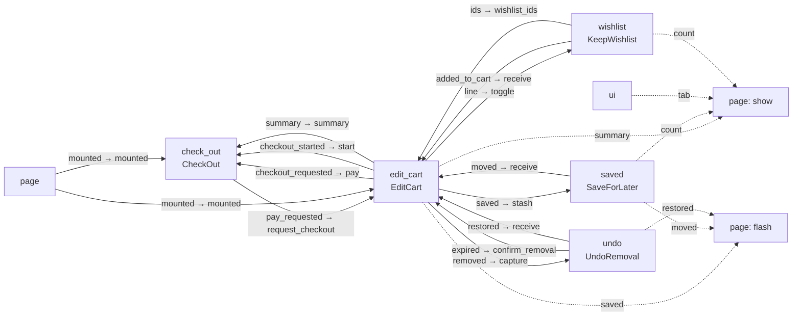
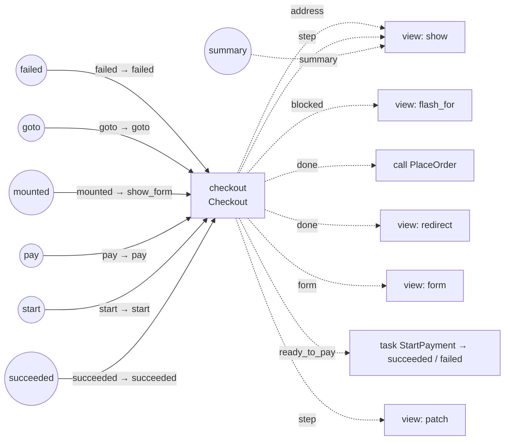

# V47: Typed story maps

V39-max with Spray's Features layer, typed ports, and a diagram drawn from the value that runs. Each
page is a composition of user stories; each story's wiring is a bindings map, and the page's own map
links the stories. Every port has a type, and the whole composition is checked when the page mounts.
Blog post: [V47, typed story maps](https://getdown.dev/blog/intro-to-v47-typed-story-maps/).

**Score:** full checklist by hand **100** under the 2026-10-02 stricter readings. `ala_lint` 100/A
default, 100/A strict (10 of 10 checked rules met), 99/A super-strict. **95 tests, 0 failures**,
including the storefront and portal acceptance tests every full variant shares. Familiarity 3 of 5.
Zero message hops.

## What it changes from V39-max

- **Stories (Spray's features).** "Each feature creates instances of domain abstractions, configures
  the instances with feature specific details, and connects them together as needed to express the
  feature or user story" (§2.2). The stories are the same as V46's: `EditCart`, `UndoRemoval`,
  `SaveForLater`, `KeepWishlist` and `CheckOut` on the cart page; `EditOrder`, `BrowseCatalog`,
  `SubmitOrder` and the same `UndoRemoval` on the portal. Each has a `bindings` map (its diagram as a
  value), `event/4` clauses that decode browser events, and a view built from domain UI components.
- **The page is the root story.** Its `bindings/0` map has 16 entries on the cart page, nearly all
  links between stories (`{:edit_cart, :removed} => [{:to, :undo, :capture}]`), and 8 on the portal.
- **Typed ports, checked at mount.** Every port declares a type; `Ports.Call` instances declare which
  payload types they accept and what each answers (`AddLine`: `product → item`,
  `product_quantity → item_quantity`); a plain function's answer type is written in its binding.
  `Binder.mount/2` refuses a composition with a wire between two types, an output neither bound nor
  grounded, an unbound input, or an anonymous function in a binding.
- **A diagram drawn from what runs.** `Diagram.mermaid/1` draws the page's stories and links, and
  `Diagram.mermaid_story/2` one story's insides, from the same value the page mounts (below).
- **State, not Features**, and **a record form instead of `FormComponent`**, as in V46.
- **Timers and tasks report to the story's own inputs**, so a page has one generic clause for each.

## The cart page, drawn from its composition



The checkout story inside:



## Run it

```bash
cd v47-typed-story-maps
mix deps.get
mix test
```
