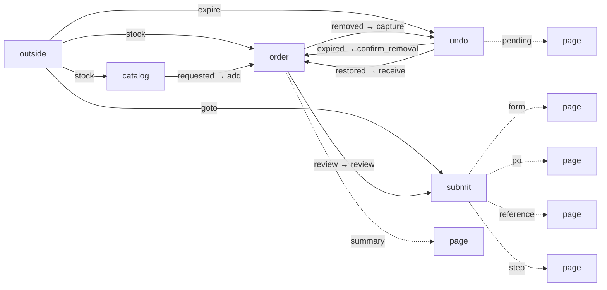

# GoodDealWeb.PortalLive.Show, as it ran

```mermaid
flowchart LR
  outside -->|"stock"| catalog
  outside -->|"stock"| order
  outside -->|"goto"| submit
  outside -->|"expire"| undo
  catalog -->|"requested → add"| order
  order -->|"removed → capture"| undo
  order -->|"review → review"| submit
  order -.->|"summary"| page_order_summary[page]
  submit -.->|"form"| page_submit_form[page]
  submit -.->|"po"| page_submit_po[page]
  submit -.->|"reference"| page_submit_reference[page]
  submit -.->|"step"| page_submit_step[page]
  undo -->|"expired → confirm_removal"| order
  undo -.->|"pending"| page_undo_pending[page]
  undo -->|"restored → receive"| order
```
