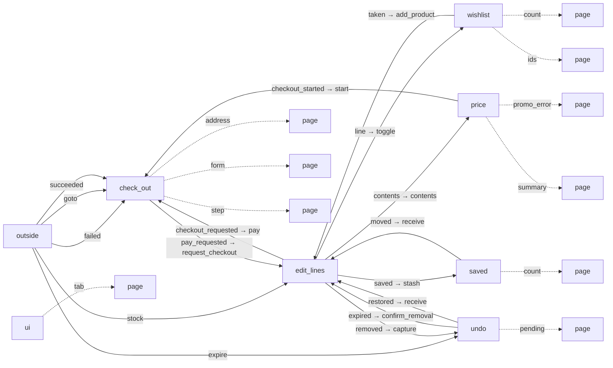

# GoodDealWeb.CartLive.Show, as it ran

```mermaid
flowchart LR
  outside -->|"failed"| check_out
  outside -->|"goto"| check_out
  outside -->|"succeeded"| check_out
  outside -->|"stock"| edit_lines
  outside -->|"expire"| undo
  check_out -.->|"address"| page_check_out_address[page]
  check_out -.->|"form"| page_check_out_form[page]
  check_out -->|"pay_requested → request_checkout"| edit_lines
  check_out -.->|"step"| page_check_out_step[page]
  edit_lines -->|"checkout_requested → pay"| check_out
  edit_lines -->|"contents → contents"| price
  edit_lines -->|"line → toggle"| wishlist
  edit_lines -->|"removed → capture"| undo
  edit_lines -->|"saved → stash"| saved
  price -->|"checkout_started → start"| check_out
  price -.->|"promo_error"| page_price_promo_error[page]
  price -.->|"summary"| page_price_summary[page]
  saved -.->|"count"| page_saved_count[page]
  saved -->|"moved → receive"| edit_lines
  ui -.->|"tab"| page_ui_tab[page]
  undo -->|"expired → confirm_removal"| edit_lines
  undo -.->|"pending"| page_undo_pending[page]
  undo -->|"restored → receive"| edit_lines
  wishlist -.->|"count"| page_wishlist_count[page]
  wishlist -.->|"ids"| page_wishlist_ids[page]
  wishlist -->|"taken → add_product"| edit_lines
```
