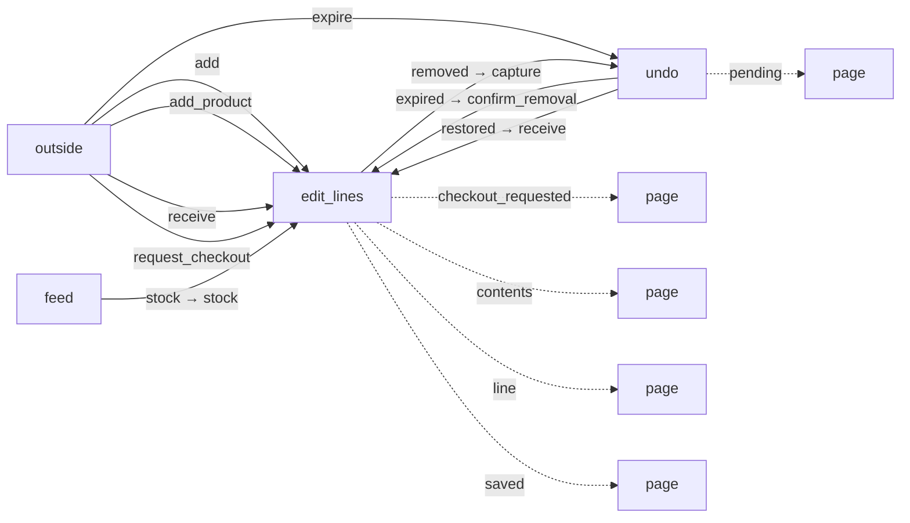

# GoodDealWeb.Stories.DraftOrder, as it ran

```mermaid
flowchart LR
  outside -->|"add"| edit_lines
  outside -->|"add_product"| edit_lines
  outside -->|"receive"| edit_lines
  outside -->|"request_checkout"| edit_lines
  outside -->|"expire"| undo
  edit_lines -.->|"checkout_requested"| page_edit_lines_checkout_requested[page]
  edit_lines -.->|"contents"| page_edit_lines_contents[page]
  edit_lines -.->|"line"| page_edit_lines_line[page]
  edit_lines -->|"removed → capture"| undo
  edit_lines -.->|"saved"| page_edit_lines_saved[page]
  feed -->|"stock → stock"| edit_lines
  undo -->|"expired → confirm_removal"| edit_lines
  undo -.->|"pending"| page_undo_pending[page]
  undo -->|"restored → receive"| edit_lines
```
